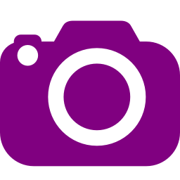
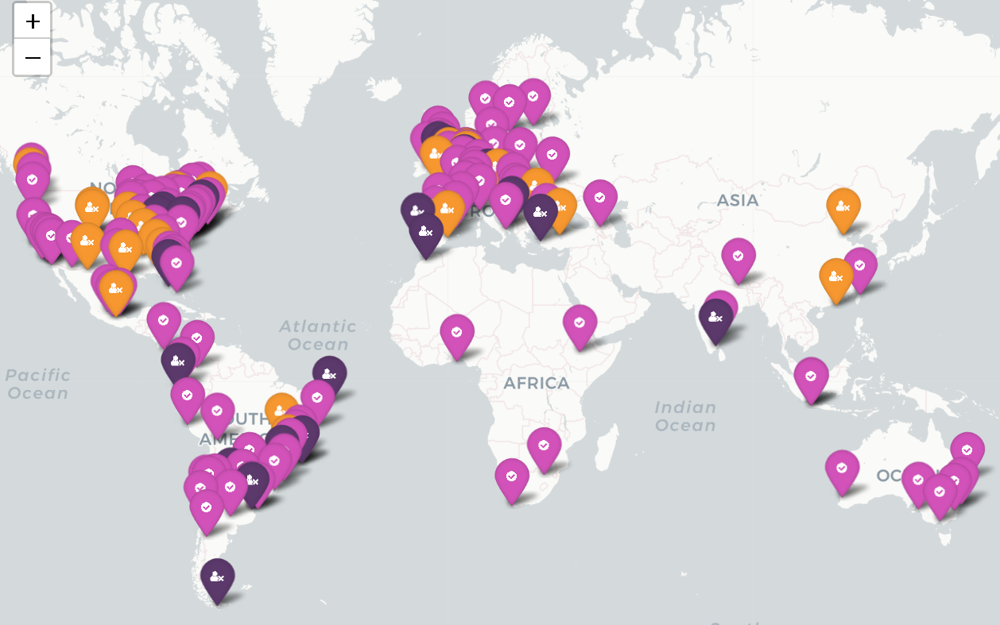
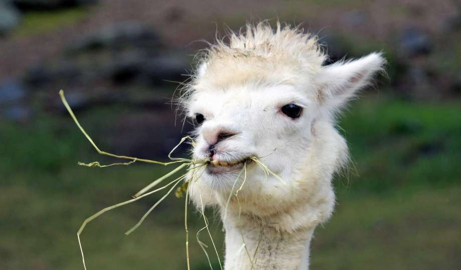
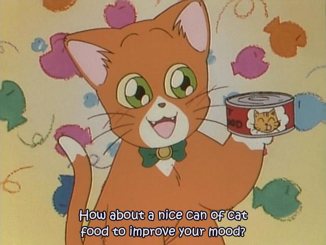
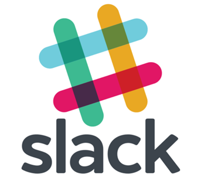
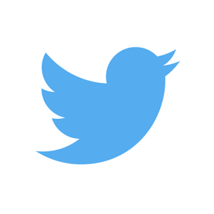

class: inverted

# The mission

**Worldwide** organization
 
 
… that promotes **gender diversity** in the R- community
 
 
… via meetups and mentorship
 
 
… in a **friendly** and **safe environment**

---
class: center

# Ok if we take pictures?

# Otherwise, let us know!

---

# R-Ladies around the world

---

# R-Ladies Rotterdam

We are doing 2 types of activities:

.pull-left[

### Workshops:

Find materials of previous meetups in our [github repo](https://github.com/rladies/meetup-presentations_rotterdam)
]

--

.pull-right[
### Social events/drinks

]

---

# R-Ladies Rotterdam

We are 3 organizers:

---

# Online community

.pull-left[

- RLadies Netherlands (by email)

- [RLadies Community (Global)](https://rladies-community-slack.herokuapp.com/)
]

.pull-right[

- @RLadiesRdam

- @WeAreRladies

- @RLadiesGlobal

]

---
# Code of conduct

** Everyone** participating must agree on the code of conduct.

 
 

_**Excerpt:** R-Ladies is dedicated to providing a harassment-free experience for everyone. We do not tolerate harassment of participants in any form._

 
 
 Read the full version here: https://rladies.org/code-of-conduct

  This ensures that the environment of meetups stays **safe** and **friendly**!
---

# Get Involved

Our community is based on volunteer work. 

 

In order to keep on going, we need more hands so **join the organizing team :)**

--
.pull-left[
### Speakers

- 5 min lightning talk
- 30 min - 60 min talks
- Workshop

_Accessible way to practice communication/presentation skills_

]
--

.pull-right[
### Sponsors

Tell your company to sponsor us!
- Location
- food/drinks/icecream

]
--

.pull-left[
### ping rotterdam@rladies.org
]
---

# Other announcements

- Welcome *R-Ladies Den Bosch*

--

- Fill our [survey](https://docs.google.com/forms/d/e/1FAIpQLSdQ9X6Z1rJQEotasqUMnegiEQB-TTbkmQq7xflsFFNbjCQMRQ/viewform) (~2min)! 
This will help us have a better insight of our community and their interests and help us plan future events.

---
class: center, inverse
background-image: url("erum.jpeg")
background-size: cover
---

class: center, middle

# Thanks!

Slides created via the R package [**xaringan**](https://github.com/yihui/xaringan).

The chakra comes from [remark.js](https://remarkjs.com), [**knitr**](http://yihui.name/knitr), and [R Markdown](https://rmarkdown.rstudio.com).
